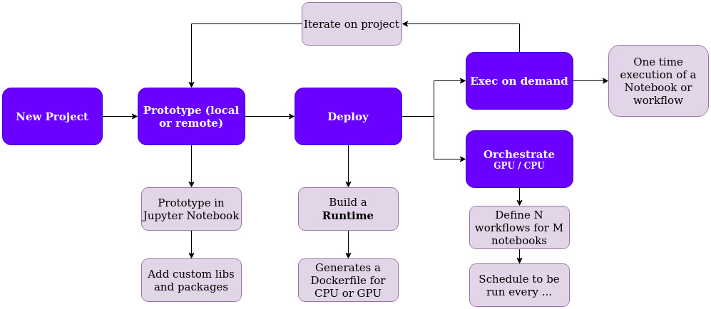

# LabFunctions

“I’m a scientist; because I invent, transform, create, and destroy for a living, and when I don’t like something about the world, I change it.” — Pickle Rick 

## Description 

LabFunctions is a set of tools (libraries and services) that allows you to work locally exploring data, building machine learning models and then executing them in production without changing any code. **From EDA to Prod in one push of code.**

It was thought to empower different data roles to put notebooks into production whatever they do, this notebooks could be models, ETL process, crawlers, etc. This way of working should allow going backward and foreward in the process of building data products. 

Although this tool allow different workflows in a data project, we propose this one as an example:

[+ Info](https://algorinfo.notion.site/LabFunctions-2c1544f17270460eac686b2cc2eeb1cd)

## Status 

> ⚠️ Although the project is considered stable 
> please keep in mind that LabFunctions is still under active development
> and therefore full backward compatibility is not guaranteed before reaching v1.0.0., APIS could change.

## Roadmap

Next generation 0.10 

Working on the next generation of LabFunctions. It will allow other kinds of semantics 
like for instance attaching volumes to Jobs, or scheduling pods in a K8S platform. 

State tunned: [NextGen](https://algorinfo.notion.site/Next-Gen-0-10-2742d705144342089f6dac86e0c8e684)

The development of new features and refactoring will happen in a new long-lived branch called **nextgen-010**, keeping the main branch only for patches to the version [0.9](https://github.com/labfunctions/labfunctions/tree/releases/0.9.0)

## Features

Some features can be used standalone, and others depend on each other.

| Feature             | Status |  Note   |
| --------------------| ------ | ------- |
| Notebook execution  | Stable |  - |
| Workflow scheduling | Beta   | This allow to schedule: every hour, every day, etc |
| Build Runtimes      | Beta   | Build OCI compliance continers (Docker) and store it. | 
| Runtimes templates  | Stable | Genereate Dockerfile based on templates
| Create and destroy servers | Alpha | Create and delete Machines in different cloud providers |
| GPU Support | Stable | Allows to run workloads that requires GPU 
| Execution History | Alpha | Track notebooks & workflows executions |
| Google Cloud support | Beta | Support google store and google cloud as provider |
| Secrets managment | Alpha | Encrypt and manager private data in a project | 
| Project Managment | Alpha | Match each git repostiroy to a project |

## Cluster options

It is possible to run different cluster configurations with custom auto scalling policies

Instances inside a cluster could be created manually or automatically

See a simple demo of a gpu cluster creation

[https://www.youtube.com/watch?v=-R7lJ4dGI9s](https://www.youtube.com/watch?v=-R7lJ4dGI9s)

## :post_office: Architecture

## :bookmark_tabs: References & inspirations
- [Notebook Innovation - Netflix](https://netflixtechblog.com/notebook-innovation-591ee3221233)
- [Tensorflow metastore](https://www.tensorflow.org/tfx/guide/mlmd)
- [Maintainable and collaborative pipelines](https://blog.jupyter.org/ploomber-maintainable-and-collaborative-pipelines-in-jupyter-acb3ad2101a7)
- [The magic of Merlin](https://shopify.engineering/merlin-shopify-machine-learning-platform)
- [Scale aware approach](https://queue.acm.org/detail.cfm?id=3025012)
- [

## Contributing

Bug reports and pull requests are welcome on GitHub at the [issues
page](https://github.com/labfunctions/labfunctions). This project is intended to be
a safe, welcoming space for collaboration, and contributors are expected to
adhere to the [Contributor Covenant](http://contributor-covenant.org) code of
conduct.

Please refer to [this
document](https://github.com/dymaxionlabs/toolkit#dymaxion-labs-toolkit-charter)
for more details about our current governance model and formal committers
group.

## History

Labfunctions was initially developed by [Xavier Petit](https://www.linkedin.com/in/xavier-petit-de-meurville-90200b41/) in the context of the needs of [algorinfo.com](https://algorinfo.com) and inspired by the following posts:  [Netflix](https://netflixtechblog.com/notebook-innovation-591ee3221233) and [Maintainable and collaborative pipelines](https://blog.jupyter.org/ploomber-maintainable-and-collaborative-pipelines-in-jupyter-acb3ad2101a7), during the second half of 2021. 

The common cycle of work before the idea of labfunctions was to start exploring and prototyping models and processes in Jupyter Notebooks and then migrate those notebooks to packages and modules in python, finally the code was deployed as containers into production. 

At that time the problem to solve was to reduce the step required from notebooks to production, then labfunctions emerge first as a module in the context of [dataproc](https://github.com/algorinfo/dataproc) using Sanic, RQ and Papermill as main libraries to orchestrate and execute notebooks as workflows.  

In 2022 Xavier Petit started working as a freelancer in [DymaxionLabs](https://dymaxionlabs.com/). They have a similar problem to be solved, but with two extra requirements: notebooks should be reproducible, and workloads usually require GPU hardware that should be provisioned on demand. With those two needs in mind, labfunctions was born adding: the idea of a “project” which match to a  Git Repository, the builds of docker containers (called runtimes in labfunctions) and the option to create servers on demand, each step with GPU support.   

## License

This project is licensed under Apache 2.0. Refer to
[LICENSE.txt](https://github.com/labfunctions/labfunctions/blob/main/LICENSE).
